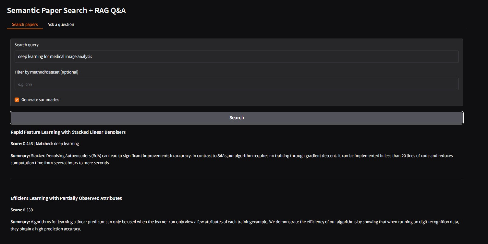
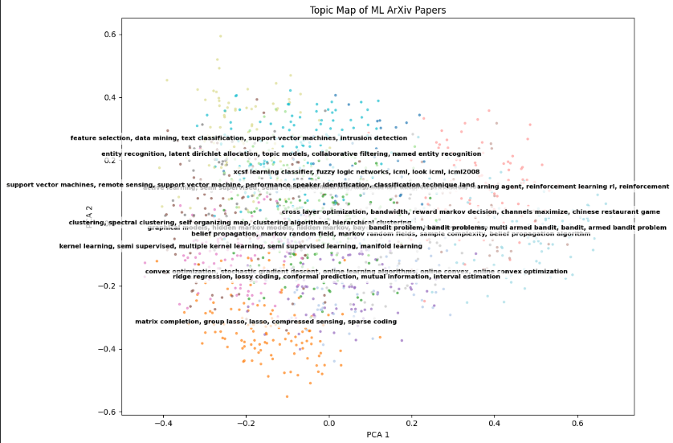
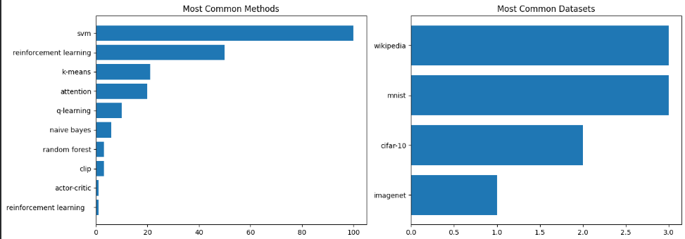

# 🧠 PaperMind AI
### AI-Powered Research Assistant for Scientific Literature

<p align="center">
  
</p>


PaperMind AI is an AI-powered research assistant that helps researchers discover, analyze, summarize, and interact with scientific papers using Natural Language Processing (NLP), Semantic Search, Scientific Named Entity Recognition (NER), Research Analytics, and Retrieval-Augmented Generation (RAG).

The project began as a semantic research paper search engine and has been extended into a complete research assistant capable of searching papers by meaning, extracting scientific entities, generating summaries, visualizing research trends, clustering topics, and answering research questions using retrieved papers.

---

# ✨ Features

### 🔍 Semantic Paper Search
- Search research papers using semantic similarity instead of exact keyword matching.
- Powered by Sentence Transformers and FAISS vector search.

### ⚡ Hybrid Search
- Combines semantic similarity with extracted scientific entities and keywords.
- Supports filtering by methods and datasets.

### 📄 Automatic Summarization
- Generates concise summaries of retrieved research papers.
- Uses Facebook BART for abstractive summarization.

### 🧬 Scientific Named Entity Recognition
Automatically extracts:

- Methods
- Datasets
- Metrics
- Scientific Concepts

using SciSpaCy together with a custom entity classification pipeline.

### 🔑 Keyword Extraction
- Extracts important keywords using KeyBERT.
- Improves search quality and research analysis.

### 📊 Research Analytics
Analyze your research collection through:

- Most common research methods
- Most common datasets
- Entity frequency analysis
- Research statistics

### 🗺 Topic Clustering
Projects research papers into a low-dimensional space using PCA to visualize topic clusters and relationships between papers.

### 📈 Trend Analysis
Tracks the popularity of research methods over time using publication dates retrieved from the arXiv API.

### 🤖 Retrieval-Augmented Generation (RAG)
Ask natural language questions about research papers and receive grounded answers generated from retrieved documents.

### 🎨 Interactive Gradio Interface
A clean web interface that integrates:

- Semantic Search
- Hybrid Retrieval
- Summarization
- RAG Question Answering

---

# 🏗 Project Workflow

```
                   User Query
                        │
                        ▼
             Sentence Transformer
                        │
                        ▼
                FAISS Vector Search
                        │
                        ▼
                 Hybrid Re-ranking
                        │
          ┌─────────────┴─────────────┐
          ▼                           ▼
  Scientific NER               Keyword Matching
          │                           │
          └─────────────┬─────────────┘
                        ▼
             Relevant Research Papers
                        │
        ┌───────────────┴───────────────┐
        ▼                               ▼
 Automatic Summarization          RAG Question Answering
        │
        ▼
 Research Analytics & Topic Clustering
```

---

# 📸 Project Screenshots

## Semantic Search + RAG Interface

<p align="center">

</p>

---

## Topic Clustering

<p align="center">

</p>

---

## Research Analytics

<p align="center">

</p>

---

# 🛠 Tech Stack

| Category | Technology |
|-----------|------------|
| Programming Language | Python |
| Semantic Embeddings | Sentence Transformers |
| Vector Database | FAISS |
| NLP | SpaCy + SciSpaCy |
| Keyword Extraction | KeyBERT |
| Summarization | Facebook BART |
| RAG | Hugging Face Transformers |
| Machine Learning | Scikit-learn |
| Data Processing | Pandas, NumPy |
| Visualization | Matplotlib |
| Interface | Gradio |
| Dataset | arXiv API |

---

# 📂 Repository Structure

```
papermind-ai/
│
├── README.md
├── LICENSE
├── requirements.txt
├── papermind_ai.ipynb
│
├── images/
│   ├── app.jpeg
│   ├── topic_map.png
│   ├── analytics.png
│   └── architecture.png
│
├── docs/
│
└── data/
```

---

# 🚀 Installation

Clone the repository

```bash
git clone https://github.com/<YOUR_USERNAME>/papermind-ai.git
```

Move into the project directory

```bash
cd papermind-ai
```

Install dependencies

```bash
pip install -r requirements.txt
```

Launch the notebook

```bash
jupyter notebook papermind_ai.ipynb
```

or open it directly in Google Colab.

---

# 📌 Future Improvements

- PDF Upload Support
- Multi-paper Comparison
- Citation Network Visualization
- Research Recommendation Engine
- Hugging Face Spaces Deployment
- Docker Support
- Persistent Vector Database
- Interactive Analytics Dashboard

---

# 🎯 Learning Outcomes

This project helped me gain practical experience with:

- Semantic Search
- Retrieval-Augmented Generation (RAG)
- Vector Databases (FAISS)
- Scientific NLP
- Information Retrieval
- Sentence Embeddings
- Named Entity Recognition
- Keyword Extraction
- Research Analytics
- Interactive AI Applications using Gradio

---

# 🙏 Acknowledgements

The foundation of this project was built under the guidance of my mentor, who introduced me to semantic search and research paper retrieval.

I later extended the project by implementing:

- Hybrid Retrieval
- Scientific NER
- Keyword Extraction
- Research Analytics
- Topic Clustering
- Trend Analysis
- Retrieval-Augmented Generation (RAG)
- Enhanced Gradio Interface

These additions transformed the project into a more comprehensive AI-powered research assistant.

---

# 📄 License

This project is licensed under the MIT License.

---

⭐ If you found this project interesting, consider giving the repository a star!
